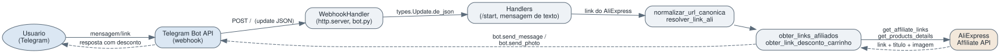

# Bot de Afiliados AliExpress para Telegram

Bot de Telegram desenvolvido sob encomenda para Renan Susano. Recebe links de produtos do AliExpress enviados por usuarios em uma conversa ou grupo e responde com links de afiliado (aba de moedas e afiliado padrao) gerados via API oficial de afiliados do AliExpress, junto com titulo e imagem do produto quando disponiveis. Escrito em Python, roda como um servidor HTTP que recebe atualizacoes do Telegram via webhook (nao polling).

---

## Sumario

- [Colaboradores](#colaboradores)
- [Tecnologias](#tecnologias)
- [Escopo do Projeto](#escopo-do-projeto)
- [Estrutura do Projeto](#estrutura-do-projeto)
- [Requisitos](#requisitos)
- [Configuracao](#configuracao)
- [Como Executar](#como-executar)
- [Arquitetura](#arquitetura)
- [Fluxo de Ponta a Ponta (exemplo)](#fluxo-de-ponta-a-ponta-exemplo)
- [Testes](#testes)

---

## Colaboradores

| Nome | Papel |
| --- | --- |
| Gustavo Vieira de Araújo | Desenvolvedor |

---

## Tecnologias

| Tecnologia | Uso |
| --- | --- |
| Python 3.10+ | Linguagem principal do bot. |
| pyTelegramBotAPI (`telebot`) | Cliente da API do Telegram: registro de handlers, teclados inline, envio de mensagens/fotos. |
| python-aliexpress-api | Cliente da API oficial de afiliados do AliExpress: geracao de links de afiliado e detalhes de produto. |
| python-dotenv | Carrega as variaveis de ambiente do arquivo `.env` em tempo de execucao. |
| requests | Resolucao de links encurtados (`s.click.aliexpress.com`, `a.aliexpress.com`) e chamadas HTTP diretas. |
| `http.server` (biblioteca padrao) | Servidor HTTP minimalista que recebe o webhook do Telegram (sem framework web). |

---

## Escopo do Projeto

| Requisito | Implementacao |
| --- | --- |
| Receber link do AliExpress em texto livre e responder com link de afiliado | `handle_mensagem` + `obter_links_afiliados` (`bot.py`) |
| Normalizar links em formatos diferentes (`/item/`, `productIds`, `/ssr/`, links encurtados) | `normalizar_url_canonica`, `resolver_link_ali`, `obter_url_final`, `extrair_redirect_url_recursiva` |
| Gerar link promocional da aba de moedas | `construir_link_promocao` |
| Buscar titulo e imagem do produto quando disponiveis | `obter_links_afiliados` (chamada a `get_products_details`) |
| Menu com opcoes extras para um usuario administrador especifico | `handle_start` (verificacao de `user_id` fixada no codigo) |
| Suporte a links de carrinho com desconto (`coin-index`) | `obter_link_desconto_carrinho` |
| Receber atualizacoes do Telegram via webhook em vez de polling | `WebhookHandler`, `configurar_webhook`, `start_server` |
| **Extra:** responder com HTTP 400 em vez de derrubar a conexao quando o webhook recebe um payload que nao e JSON valido | `WebhookHandler.do_POST` |

---

## Estrutura do Projeto

| Diretorio / Arquivo | Descricao |
| --- | --- |
| `bot.py` | Ponto de entrada unico: configuracao do bot e da API do AliExpress, normalizacao de links, handlers do Telegram e servidor HTTP do webhook. |
| `assets/` | Imagens (`bibi-1.jpg` a `bibi-4.jpg`) usadas nas mensagens de boas-vindas e nos links de desconto de carrinho. |
| `docs/architecture.svg` | Diagrama do fluxo de uma mensagem, do usuario no Telegram ate a API de afiliados do AliExpress. |
| `.env.save` | Modelo das variaveis de ambiente esperadas. Deve ser copiado para `.env` e preenchido com credenciais reais (nunca commitado). |
| `.gitignore` | Ignora `.env` e `*.pyc`; a partir desta modernizacao tambem ignora `venv/`. |
| `requirements.txt` | Dependencias Python fixadas por versao. |

---

## Requisitos

| Dependencia | Versao | Instalacao |
| --- | --- | --- |
| Python | 3.10 ou superior | [python.org/downloads](https://www.python.org/downloads) |
| pip | qualquer recente | incluido na instalacao do Python |
| Bot no Telegram | - | criado via [@BotFather](https://t.me/BotFather), gera o `TOKEN_BOT` |
| Conta de afiliado AliExpress | - | fornece `CHAVE_APP`, `SEGREDO_APP` e `ID_RASTREAMENTO` |
| URL publica HTTPS | - | necessaria para o Telegram entregar o webhook (dominio proprio ou tunel como `ngrok`) |

```bash
python3 -m venv venv
source venv/bin/activate        # Windows: venv\Scripts\activate
pip install -r requirements.txt
```

---

## Configuracao

Copie o modelo de variaveis de ambiente e preencha com valores reais:

```bash
cp .env.save .env
```

| Variavel | Descricao |
| --- | --- |
| `TOKEN_BOT` | Token do bot, gerado pelo @BotFather. |
| `CHAVE_APP` | App Key da API de afiliados do AliExpress. |
| `SEGREDO_APP` | App Secret da API de afiliados do AliExpress. |
| `ID_RASTREAMENTO` | Tracking ID de afiliado usado nas chamadas da API. |
| `LINK_TELEGRAM_CHAT` | Link do canal/grupo de chat exibido no menu padrao. |
| `LINK_TELEGRAM_OFERTAS` | Link do canal de promocoes exibido no menu padrao. |
| `LINK_YOUTUBE` | Link do canal do YouTube exibido no menu padrao. |
| `URL_WEBHOOK` | URL publica HTTPS para onde o Telegram deve enviar as atualizacoes (ex.: `https://seudominio.com/webhook`). |
| `PORT` | Porta em que o servidor HTTP local escuta (padrao `8080`). |

O arquivo `.env` nunca deve ser commitado, pois ja esta listado em `.gitignore`. `.env.save` contem apenas valores de exemplo e pode ficar versionado.

---

## Como Executar

```bash
source venv/bin/activate
python bot.py
```

Ao iniciar, o script:

1. Carrega as variaveis de ambiente e valida `TOKEN_BOT` (encerra com erro se ausente).
2. Configura o cliente da API de afiliados do AliExpress.
3. Registra os handlers do Telegram (`/start` e mensagens de texto).
4. Remove qualquer webhook anterior e registra `URL_WEBHOOK` junto ao Telegram.
5. Sobe um servidor HTTP (`http.server`) na porta `PORT`, que fica ouvindo `POST /` para receber as atualizacoes do Telegram.

Para testar localmente sem expor um dominio proprio, exponha a porta com um tunel (`ngrok http 8080`, por exemplo) e use a URL gerada como `URL_WEBHOOK`.

---

## Arquitetura



| Componente | Responsabilidade |
| --- | --- |
| Telegram Bot API | Recebe a mensagem do usuario e entrega a atualizacao ao bot via webhook HTTP. |
| `WebhookHandler` (`bot.py`) | Servidor HTTP que recebe o `POST` do Telegram, valida o JSON e repassa a atualizacao para o `TeleBot`. |
| Handlers (`/start`, mensagem de texto) | Decidem o menu a exibir e disparam a extracao/normalizacao do link enviado. |
| Normalizacao de links | Converte qualquer formato de link do AliExpress (direto, `productIds`, `/ssr/`, encurtado) para a URL canonica do produto. |
| Geracao de links de afiliado | Chama a API de afiliados do AliExpress para obter o link de desconto e, quando disponivel, titulo e imagem do produto. |
| Resposta ao usuario | Envia a foto (ou texto, se a imagem falhar) com os links de desconto de volta ao chat de origem. |

---

## Fluxo de Ponta a Ponta (exemplo)

1. **Alice** envia no chat: `Confere esse produto https://www.aliexpress.com/item/1005006123456789.html`.
2. O Telegram entrega a atualizacao ao webhook:

```json
{
  "message": {
    "chat": { "id": 111222333 },
    "text": "Confere esse produto https://www.aliexpress.com/item/1005006123456789.html"
  }
}
```

3. `extrair_url_do_texto` isola a URL; `normalizar_url_canonica` a converte para `https://www.aliexpress.com/item/1005006123456789.html`.
4. `obter_links_afiliados` chama a API de afiliados duas vezes (link direto e link promocional da aba de moedas) e busca titulo/imagem do produto.
5. O bot responde no mesmo chat com uma foto do produto e a legenda contendo os dois links de desconto, junto com o menu de canais (chat, promocoes, YouTube).
6. Se **Bob** (definido como administrador no codigo) enviar `/start`, recebe um menu adicional com botoes de produtos fixos, em vez do menu padrao.

---

## Testes

Nao ha suite automatizada. A validacao foi feita manualmente, subindo o servidor do webhook localmente com um token de teste e chamando o endpoint diretamente:

```bash
python3 -c "import bot; bot.start_server()" &
curl -i -X POST http://localhost:8080/ -d '{"foo": "bar"}'    # -> 200 OK
curl -i -X POST http://localhost:8080/ -d 'nao e json'         # -> 400 Bad Request (nao derruba mais a conexao)
curl -i http://localhost:8080/                                  # -> 200 OK, "Bot esta rodando."
```

As funcoes de normalizacao de link (`normalizar_url_canonica`, `construir_link_promocao`, `extrair_url_do_texto`) tambem foram exercitadas diretamente com URLs reais do AliExpress em diferentes formatos (link direto, `/ssr/`, encurtado) para confirmar que todas convergem para a mesma URL canonica.

---

> Documentacao gerada com auxilio de IA.
